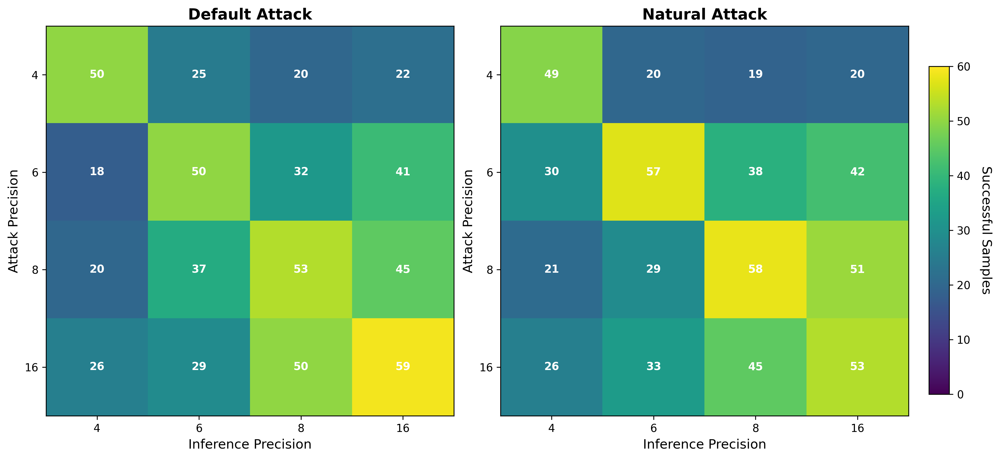

# Efficient LLMs via Switchable and Dynamic Quantization

## 1 Quantization

We implemented a per-channel symmetric MinMax quantization module. For simplicity, activations were not quantized.

This is a fake quantization module where quantization is performed during the forward pass. As a result, switching the bit width is a simple O(1) operation.

There are 49 linear layers in GPT-2: 12 layers × (2 attention + 2 FFN) + 1 LM head. The quantization configuration allows these layers to have different bit widths.

## 2 LoRA

We added multiple full-precision LoRA modules to the quantized linear layers, each corresponding to a specific quantization configuration.

## 3 Cascade Distillation Training

We fine-tuned the above model (GPT-2 model with quantization and multiple LoRA modules) on the [SQuAD](https://huggingface.co/datasets/squad) dataset.

We modeled the task as prompt completion. The main training objective is perplexity on the answer part.

For simplicity, we only evaluated answer perplexity and exact match accuracy on the validation set. When publishing the results, we will need to evaluate other common metrics to allow easy comparison to other works.

## 4 Evaluation Results

### 4.1 Experimental Setup

The default configuration used for evaluation:

- **Quantization variants**: 16-bit, 8-bit, 6-bit, 5-bit, 4-bit
- **LoRA configuration**:
  - Rank: $8$ for 6~16-bit, $16$ for 4~5-bit
  - Alpha: $\mathrm{rank} \times 2$ for 5~16-bit, $\mathrm{rank} \times 4$ for 4-bit
- **Training parameters**:
  - Distillation loss weight: $\beta = 1$
  - Optimizer: AdamW with $\gamma = 2 \times 10^{-4}$
  - Batch size: 2
  - 1000 iterations

### 4.2 Performance

The performance across different quantization levels:

| Precision | Loss        | Accuracy  | Compression |
|-----------|-------------|-----------|-------------|
| 16-bit    | 0.898       | 41.8%     | 61.3%       |
| 8-bit     | 0.893       | **43.1%** | 47.9%       |
| 6-bit     | **0.871**   | 43.0%     | 38.6%       |
| 5-bit     | 0.930       | 39.1%     | 34.7%       |
| 4-bit     | 1.054       | 37.3%     | **32.3%**   |

**Key Observations:**
- Up to 6-bit, the accuracy is well maintained
- 4-bit shows a significant drop in accuracy, indicating a threshold for effective quantization
- 6-bit quantization achieves a good balance between accuracy and compression, making it suitable for production use

### 4.3 Impact of Distillation Loss Weight (β)

We evaluated different values of the distillation loss weight $\beta$ to understand its impact on model performance:

| β Value | Training Loss | 16-bit VL     | 8-bit VL     | 6-bit VL     | 5-bit VL     | 4-bit VL     |
|---------|---------------|---------------|--------------|--------------|--------------|--------------|
| 0       | 1.311         | **0.898**     | 0.936        | 0.924        | 0.978        | 1.138        |
| 0.1     | 1.565         | **0.898**     | 0.903        | 0.898        | 0.944        | 1.109        |
| 1       | 3.638         | **0.898**     | **0.893**    | **0.871**    | **0.930**    | **1.054**    |
| 10      | 24.346        | **0.898**     | 0.956        | 0.965        | 1.019        | 1.202        |

VL stands for validation loss. The highest precision (16-bit) is unaffected by the distillation loss weight.

**Key Observations:**
- Cascade distillation is effective for all bit widths
 - Surprisingly, 6-bit student model performs better than 16-bit teacher
- $\beta = 1$ provides the best result across all bit widths
- When distillation loss becomes the dominant term, the model performance degrades

### 4.4 Component-wise Quantization

We explored different quantization schemes for different model components:

| Attn Bits | FFN Bits | LM Head Bits | Loss  | Acc   |
|-----------|----------|--------------|-------|-------|
| 4         | 4        | 4            | 1.054 | 37.3% |
| 3         | 4        | 4            | 1.280 | 28.6% |
| 4         | 3        | 4            | 1.370 | 30.0% |
| 4         | 4        | 3            | 1.374 | 27.2% |
| 5         | 5        | 5            | 0.930 | 39.1% |
| 4         | 5        | 5            | 0.964 | 39.0% |
| 5         | 4        | 5            | 0.969 | 38.8% |
| 5         | 5        | 4            | 1.036 | 36.3% |

The ratio of parameter count in each component is approximately 2:4:3 for attention, FFN, and LM head layers.

**Key Observations:**
- 3-bit quantization is not effective for any component
  - A better quantization scheme is needed for sub-4-bit levels
- LM head layer is sensitive to quantization
- Tuning bit widths for different components is not straightforward
  - A bigger grid search is needed to draw more conclusions

### 4.5 Layer-wise Quantization

We explored different quantization schemes for different layers of the model:

| Bits (1~4) | Bits (5~8) | Bits (9~12) | LM Head Bits | Loss  | Acc   |
|------------|------------|-------------|--------------|-------|-------|
| 4          | 4          | 4           | 4            | 1.054 | 37.3% |
| 5          | 4          | 4           | 4            | 1.006 | 39.8% |
| 4          | 5          | 4           | 4            | 1.025 | 39.1% |
| 4          | 4          | 5           | 4            | 1.041 | 36.7% |
| 4          | 4          | 4           | 5            | 1.041 | 37.4% |
| 5          | 5          | 5           | 5            | 0.930 | 39.1% |
| 6          | 5          | 5           | 5            | 0.914 | 39.3% |
| 5          | 6          | 5           | 5            | 0.923 | 40.8% |
| 5          | 5          | 6           | 5            | 0.930 | 39.6% |
| 5          | 5          | 5           | 6            | 0.913 | 40.3% |

**Key Observations:**
- Layer-wise quantization is effective, exhibiting clear patterns
- The first few layers are more critical for maintaining model quality

### 4.6 LoRA Rank Analysis

Impact of LoRA rank on model performance:

| LoRA Rank | 5-bit Loss | 5-bit Acc | 4-bit Loss | 4-bit Acc |
|-----------|------------|-----------|------------|-----------|
| 4         | 0.968      | 39.4%     | 1.194      | 32.4%     |
| 8         | 0.953      | 39.4%     | 1.138      | 35.3%     |
| 16        | 0.930      | 39.1%     | 1.054      | 37.3%     |
| 32        | 0.925      | 39.2%     | **1.010**  | **38.3%** |
| 64        | **0.919**  | **40.0%** | 1.025      | 36.6%     |

**Key Observations:**
- Increasing LoRA rank improves performance
- Diminishing returns after rank 32
- Rank 16 provides a good balance between performance and computational cost

### 4.7 Insights and Future Directions

We observed that cascade distillation allowed weaker models to outperform stronger teacher models, which was a surprising result. This suggests that the quantization process can lead to better generalization in some cases. The theoretical and practical aspects of this phenomenon represent a promising area for future research.

Section 4.5 demonstrated that layer-wise quantization can be effective, but it requires careful tuning. Future work could explore automated methods for determining optimal quantization configurations for each layer.

Inspired by Mixture of Experts (MoE), we can implement per-layer router models to dynamically select the quantization level. This would allow for more efficient computation by allocating resources based on the complexity of the input tokens, potentially leading to better performance and resource utilization.

## 5 Cyclic Precision Training

We conducted full model fine-tuning using Cyclic Precision Training (CPT), implementing learnable quantization modules based on [Learned Step Size Quantization](https://arxiv.org/abs/1902.08153).

### 5.1 Experimental Setup

Training was performed with the following configuration:

- **Precision range**: 3-bit to 8-bit
- **Precision cycles**: 25
- **Optimizer**: Adam with $\gamma = 2 \times 10^{-5}$
- **Batch size**: 4
- **Total iterations**: 10,000

The number of precision cycles and learning rate were tuned based on validation loss. Initial experiments with 1,000 iterations proved insufficient for convergence, thus we increased it to 10,000 iterations.

### 5.2 Results

The performance of the CPT model across different quantization levels:

| Bits | CPT Loss | CPT Acc | Base Loss | Base Acc |
|------|----------|---------|-----------|----------|
| 3    | 0.9633   | 42.70%  | 0.9324    | 44.50%   |
| 4    | 0.7811   | 48.60%  | 0.7869    | 46.50%   |
| 5    | 0.7170   | 49.90%  | 0.7388    | 48.90%   |
| 6    | 0.7006   | 50.90%  | 0.6958    | 51.20%   |
| 7    | 0.6937   | 51.40%  | 0.6919    | 49.60%   |
| 8    | 0.6864   | 51.80%  | 0.6961    | 50.70%   |

"Base" refers to the model trained without precision switching.

### 5.3 Analysis

**Key Observations:**
- CPT did not significantly improve performance compared to the baseline model
  However, it enables a single model to operate at multiple precision levels, which can be beneficial for deployment

We hypothesize that CPT may be more effective when training from scratch rather than fine-tuning. The original paper demonstrated benefits when scheduling precision levels during initial training, allowing models to explore the parameter space and learn more generalizable representations. In fine-tuning scenarios, where the model is already pre-trained on a large corpus, the adaptive benefits of precision cycling may be less pronounced as the optimization focuses on task-specific adaptation rather than fundamental representation learning.

## 6 Adversarial Robustness

To assess real-world security implications, we evaluated adversarial robustness using existing [GGUF models](https://huggingface.co/mradermacher/gpt2-GGUF) across multiple quantization levels (4-bit, 6-bit, 8-bit, 16-bit).

### 6.1 Methodology

We employed the [ARCA](https://arxiv.org/pdf/2303.04381) algorithm to generate adversarial prompts designed to elicit specific toxic outputs under greedy decoding. The attack was performed separately for each quantization level and evaluated across all models to assess transferability.

We evaluated two distinct attack configurations:

- **Default**: 5 optimizable tokens, 50 iterations, no perplexity constraint
- **Natural**: Starting with `Donald Trump`, 5 optimizable tokens, 200 iterations, with perplexity constraint ($\lambda_{\mathrm{perp}} = 1$)

Each configuration was tested on 100 two-token toxic targets. Note that for some targets, the algorithm failed to generate valid prompts.

### 6.2 Results

The adversarial robustness evaluation results are presented below (lower values indicate better robustness):

### 6.3 Analysis

**Key Observations:**
- Randomly switching quantization levels reduces attack success rates
  However, the transferability of the attacks is still indispensable
- 4-bit models demonstrate increased robustness against adversarial attacks
  Likely due to larger quantization noise disrupting adversarial perturbations
- Attacks performed on higher precision models show greater transferability across different quantization levels
- The transferability of attacks remains consistent regardless of prompt naturalness

These findings suggest that quantization, particularly at lower bit widths, can serve as an unintentional but effective defense mechanism against adversarial attacks, though this comes at the cost of some model performance.

## 7 Future Directions

Based on our exploration of switchable and dynamic quantization, we propose several promising research directions:

- Test the effectiveness of existing methods on modern LLMs and state-of-the-art quantization techniques
- Explore quantization schemes that dynamically adjust based on input characteristics
- Investigate the learning dynamics of cascade distillation and similar techniques
- Design CUDA kernels and high-level libraries for efficient dynamic quantization
